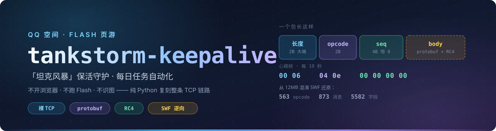

<p align="center">
  
</p>

<p align="center">
  
  
  
  
  
  
  
</p>

<p align="center">
  <b>QQ 空间 Flash 页游「坦克风暴」的保活守护与每日任务工具</b><br>
  不开浏览器 · 不跑 Flash · 不截图识图 —— 纯 Python 复刻整条 TCP 链路
</p>

<p align="center">
  <a href="#安装">安装</a> ·
  <a href="#第一次运行">第一次运行</a> ·
  <a href="#保活">保活</a> ·
  <a href="#每日任务">每日任务</a> ·
  <a href="#部署到服务器">部署</a> ·
  <a href="https://github.com/Dimlitter/tankstorm-keepalive/wiki">原理 Wiki</a>
</p>

---

```bash
python main.py --login        # 第一次：扫码登录
python main.py --daily        # 每日任务：跑一轮，退出
python main.py --keepalive    # 保活：常驻，防掉线
```

---

## 目录

- [这是什么](#这是什么)
- [开始之前](#开始之前)
- [两个独立的东西](#两个独立的东西)
- [安装](#安装)
- [第一次运行](#第一次运行)
- [登录](#登录)
- [保活](#保活)
- [每日任务](#每日任务)
- [部署到服务器](#部署到服务器)
- [配置](#配置)
- [安全机制](#安全机制)
- [命令一览](#命令一览)
- [排错](#排错)
- [开发](#开发)

---

## 这是什么

| 能力 | 说明 |
|---|---|
| **保活** | 连游戏 socket 定时发心跳，防止长时间无操作被踢下线导致基地被打 |
| **每日任务** | 自动做签到、英雄开采、将领冶炼、技能书、特工派遣、配件探索、军备制造、战略训练、军事演习、矿区争夺、国家宝箱、公会捐献等 |
| **事件告警** | 被超级强攻时 PushPlus 推到微信，带进攻方名字 |

不做的事：**不参与游戏内人机验证（超级强攻验证码）的识别、填写或自动应答。**
脚本只负责观察、解码、及时通知你本人。

---

## 开始之前

这个工具操作的是**你自己的游戏账号**，所以有几个前提。第一次用请先对一遍：

| 你需要 | 说明 |
|---|---|
| **一个在玩「坦克风暴」的 QQ 号** | 号得能正常进游戏。工具不会替你注册、也不碰密码，登录一律走手机 QQ 扫码 |
| **两块屏幕** | 扫码时二维码显示在电脑上、用手机扫。腾讯不允许"同一台设备存图再扫"，见[登录](#登录) |
| **Python 3.10 或更高** | 低于 3.10 起不来，报 `TypeError: unsupported operand type(s) for \|` |
| **能联网访问 QQ 空间和游戏服务器** | 游戏 socket 在 `tankstorm-proxy.sincetimes.com:8001` |

可选：

- **PushPlus**（微信推送）。配了之后，被超级强攻会推到微信、每日任务结果会推给你、
  登录态失效需要扫码时也会把二维码推过来。放服务器上跑建议配，[配置](#配置)里说了怎么填。

不需要：抓包工具、Flash 播放器、浏览器、模拟器。协议已经还原好了，
`protocol.json` 和字段定义都在仓库里，开箱即用。

> 只有游戏更新导致 opcode 变化时，才需要重新从 SWF 还原协议——那属于开发工作，
> 见 [Wiki](https://github.com/Dimlitter/tankstorm-keepalive/wiki)。

---

## 两个独立的东西

这是本项目最重要的一条约定，**保活和每日任务不是一回事**：

|  | 保活 `--keepalive` | 每日任务 `--daily` |
|---|---|---|
| 形态 | 常驻进程，跑几天几周 | 一次性批处理，跑完退出 |
| 职责 | 只有一个：别掉线 | 把当天的免费次数领干净 |
| 断线 | 自动重连，退避重试 | 直接结束，下次再跑 |
| 出错 | 必须尽量不出错 | 失败无所谓，明天还能领 |

**为什么要分开**：早先每日任务挂在保活里面，于是每次断线重连都要重跑一轮任务，
任务本身出问题还会牵连保活这个更重要的进程。现在默认互不干扰。

确实想"连上顺带领一轮"，显式写：

```bash
python main.py --keepalive --daily
```

---

## 安装

**第一步，先看清楚你的 Python 是哪个版本**：

```bash
python --version
```

必须是 **3.10 或更高**。很多机器上 `python` 指向的是系统自带的老版本，
装了新版也没用 —— 因为 `python` 这个名字还是指向旧的那个。

### 拿到一个 3.10+ 的环境

<details>
<summary><b>用 conda</b>（推荐，互不干扰）</summary>

```bash
conda create -n tank python=3.12 -y
conda activate tank
python --version          # 确认变成 3.12.x
```
</details>

<details>
<summary><b>用 venv</b>（系统 Python 已经是 3.10+ 时）</summary>

```bash
python -m venv .venv
# Linux / macOS
source .venv/bin/activate
# Windows PowerShell
.venv\Scripts\Activate.ps1
```
</details>

<details>
<summary><b>系统里有多个 Python，懒得建环境</b></summary>

直接用那个新版解释器的**完整路径**跑，把下文所有 `python` 换成它。
先找到它：

```bash
# Linux / macOS
which -a python3 python3.12
# Windows PowerShell
where.exe python
py -0p                    # 列出所有已安装版本及路径
```

然后例如：`C:\Users\你\miniconda3\python.exe main.py --check`
</details>

### 装依赖

```bash
git clone https://github.com/Dimlitter/tankstorm-keepalive.git
cd tankstorm-keepalive
pip install -r requirements.txt
```

依赖只有 `requests`（二维码字符画会用到 `Pillow`，没装也能跑，只是终端不显示图）。

---

## 第一次运行

按顺序走一遍，每步都能看到结果，出问题也好定位：

**1️⃣ 登录** —— 手机 QQ 扫码，只有第一次要做

```bash
python main.py --login
```

**2️⃣ 确认登录态可用** —— 能打印出 `uid` / `sid` / `level` 就说明通了

```bash
python main.py --check
```

```
cookie 有效，uid=5788xxxxx
已解析 FlashVars：server=tankstorm-proxy.sincetimes.com port=8001 uid=17645xxxx sid=2002xxxx region=18
socket 登录参数就绪: openid, openkey, uid, secret, server, port
```

**3️⃣ 看看有哪些任务、今天做了几次**

```bash
python main.py --list
```

**4️⃣ 真跑一轮**（会真实发包，做当天还没做的免费次数）

```bash
python main.py --daily
```

跑完会打一份成果表，配了 PushPlus 的话同时推到微信。

**5️⃣ 想常驻防掉线，再开保活**

```bash
python main.py --keepalive
```

到这里就跑起来了。要放到服务器上长期跑，看[部署到服务器](#部署到服务器)。

---

## 登录

```bash
python main.py --login
```

用手机 QQ 扫码。二维码会同时：终端字符画、存成 `qrcode.png`、推到 PushPlus（若已配）。

> **必须用另一台设备扫。** 存到手机再用同一台手机的相册扫，腾讯会拒，
> 提示「限制本地扫码登录」。

登录态约 1.5 天过期，脚本会用长效凭据（`ptcz`/`RK`/`superkey`）**自动续期**，
正常情况几周不用再扫。cookie 存在 `cookies.json`（已 gitignore）。

验证：

```bash
python main.py --check
```

会打印 `uid` / `sid` / `level` 等游戏上下文，能打印出来就说明登录态可用。

> **推送登录（免扫码）目前不可用。** 腾讯把 `ptqrshow` 的 `qr_push` 参数形状改了：
> 带 `type=1` 一律返回 `ec=313 提交参数错误`，换别的 `type` 值网关直接 403。
> 设备凭据齐全，不是缺票据。脚本会自动回退到扫码，不影响使用。

---

## 保活

```bash
python main.py --keepalive
```

- socket 连 `tankstorm-proxy.sincetimes.com:8001`
- 每 10 秒发 8 字节心跳 `0006040e00000000`
- 断线自动重连（退避 5s → 120s）
- 登录态失效会自动重新登录，需要人工扫码时把二维码推到 PushPlus

`Ctrl+C` 停止。想跑固定时长就设 `保持活跃.持续小时`。

---

## 每日任务

```bash
python main.py --daily      # 跑一轮
python main.py --list       # 看有哪些任务、今天做了几次
python main.py --reset      # 清空今日计数
```

### 它是怎么做一件事的

每个任务都走同一条流水线，**每一步都不能省**：

```
前置请求（开面板/查询）
      ↓  真实客户端每个动作前都会先发这个，服务端据此建上下文
闸门（读前置的响应）
      ↓  剩余免费次数 > 0 才继续；读不到就不做
动作请求
      ↓
判成败（按 ret）
      ↓  ret=0 成功；ret=1 要花钱→停；其它 ret→当天不再试
后续步骤（可选）
         占下探到的矿、按活跃度逐档领奖、国家宝箱领取+开箱
```

一轮里会**把当天的次数做完**，而不是做一次就走。免费次数是**分档**的，
比如英雄开采 `freeVisitCnt=[3,1,1]` 表示低/中/高三档各有 3/1/1 次，
三档都要领 —— 高档收益高一个数量级（实测 `nAddRes` 5000 / 10000 / 50000）。

### 任务状态

`--list` 里每项标着：

- **实测** —— 参数来自真实抓包，可放心开
- **待确认** —— 默认跳过，需先抓包核对

---

## 部署到服务器

无界面的 Linux 机器完全能跑 —— 整个项目不需要浏览器和图形界面。

只有一件事要注意：**首次登录得扫码**。三种办法任选：

1. 在本地电脑上先 `--login`，把生成的 `cookies.json` 拷到服务器（最省事）
2. 配好 PushPlus，服务器需要登录时会把二维码推到你微信
3. 把服务器上的 `qrcode.png` 下载下来看（`scp` 或任何方式）

登录态之后会自动续期，正常几周不用再管。

保活和每日任务**分开跑**，别塞进一个进程。

**systemd（保活常驻）**

```ini
[Unit]
Description=tankstorm keepalive
After=network-online.target

[Service]
WorkingDirectory=/opt/tankstorm
ExecStart=/opt/conda/envs/tank/bin/python main.py --keepalive
Restart=always
RestartSec=30

[Install]
WantedBy=multi-user.target
```

**cron（每日任务，每天早上跑一次）**

```cron
30 7 * * * cd /opt/tankstorm && /opt/conda/envs/tank/bin/python main.py --daily >> logs/cron.log 2>&1
```

任务有冷却或次数没领完时，多跑几次没有坏处 —— 已完成的会自动跳过。

---

## 配置

`config.json` 是模板；**密钥放 `config.local.json`**（已 gitignore，会深度合并覆盖）。

```jsonc
{
  "保持活跃": { "启用": true, "心跳间隔秒": 0, "重连最小秒": 5, "重连最大秒": 120 },
  "每日任务": {
    "启用": true,
    "间隔秒": 3,
    "响应等待秒": 6,
    "允许未实测参数": false,
    "任务": { "每日签到": true, "英雄开采": true }
  },
  "录制": { "启用": true, "实时解密": true, "自动拒绝超级强攻": true },
  "通知": { "PushPlus": { "token": "放到 config.local.json 里" } }
}
```

> `录制.启用` 别关。整条解码链路都挂在它下面，关掉之后每日任务读不到任何响应。

---

## 安全机制

**绝不消耗券、勋章等付费资源**，四层拦截：

| 层 | 作用 |
|---|---|
| **白名单** | 只允许发任务表里登记的 opcode，表外的连构造机会都没有 |
| **危险字段硬校验** | 字段名命中 `credit/cost/buy/num/cnt/item/card/ticket/discount` 等的，值必须为 0，否则拒发 |
| **免费次数闸门** | 先查询、读到剩余次数 > 0 才发；**读不到就不发** |
| **每日次数上限 + 冷却** | 每项每天最多 N 次，可重复任务两次之间还要等冷却 |

还有一条铁律：**没有次数依据就不重复**。曾经给没有次数字段的任务放开重试、
靠"服务器拒绝再收手"来试探，结果是免费次数用完后继续发，服务器转而扣勋章。
现在读不到剩余次数的任务一轮只做一次。

> 游戏里"消耗勋章"会弹确认框，但那是**纯客户端 UI** —— 协议里不存在二次确认消息。
> 脚本直接发包不经过任何对话框，服务器收到就扣。所以确认框对脚本的保护是 0，
> 必须在我们这一侧把危险字段拦死。

---

## 命令一览

| 命令 | 作用 |
|---|---|
| `--login` | 强制重新扫码登录 |
| `--check` | 验证登录态，打印 uid/sid/level |
| `--keepalive` | 保活常驻 |
| `--keepalive --daily` | 保活，且每次连上后顺带跑一轮任务 |
| `--daily` | 跑一轮每日任务后退出 |
| `--list` | 列出每日任务及今日进度 |
| `--reset` | 清空今日任务计数 |

不带参数会打印用法。

---

## 排错

| 现象 | 原因 / 处理 |
|---|---|
| `TypeError: unsupported operand type(s) for \|` | Python 低于 3.10。`python --version` 确认，见[安装](#安装) |
| `ModuleNotFoundError: requests` | 依赖没装，或装到了别的 Python 环境里 |
| 扫码提示「限制本地扫码登录」 | 二维码和扫码的手机是同一台设备，换另一块屏幕显示 |
| `--check` 说登录态失效 | 重新 `python main.py --login` |
| 所有任务都「未收到响应」 | 先看 `录制.启用` 是不是被关了 |
| 「闸门拦截：没收到 RseXxxOpen」 | 前置请求没回包，多半是登录态/连接问题，`--check` 看一眼 |
| 「需要花钱才能做」 | 正常，免费次数用完了，脚本主动停手 |
| 「没有可做的（已领过）」 | 正常，今天那份已经领过 |
| 推送登录失败 | 已知问题，见[登录](#登录)，自动回退扫码 |

日志在 `logs/`：

- `logs/YYYY-MM-DD.log` —— 运行日志
- `logs/frames-YYYY-MM-DD.jsonl` —— 收发的每一帧（含解码结果），排错主力
- `logs/streams/<会话>/` —— 原始字节流，供事后离线解密

> `logs/` 里有真凭据（uid/sid/openkey），已 gitignore，发出去前想清楚。

---

## 开发

```
main.py              命令行入口
tankstorm/
  qq_login.py        QQ 扫码登录（ptlogin2）
  qzone.py           取游戏页 FlashVars（uid/sid/level/firstLogin）
  socket_keepalive.py 保活主循环 + 单轮任务入口
  daily.py           每日任务表与执行引擎
  crypto.py          RC4（双向，密钥从 FlashVars 推）
  recorder.py        收发录制、实时解密、事件告警
  schema.py          协议 schema，protobuf 解码
  proto_encode.py    protobuf 编码
tools/               抓包分析与协议还原工具链
docs/                协议文档
```

### 抓包分析链路

```bash
python tools/pcap_split.py 抓包.pcapng -o streams/
python tools/redwar_rc4.py streams/<端口>/c2s.bin \
       --uid U --sid S --level L --first-login false --write
python tools/capture_daily.py streams/<端口>/c2s.bin.decrypted/frames.jsonl
```

### 游戏更新后

opcode 或字段号可能变。重新还原协议：

```bash
python tools/extract_proto.py <新的.swf> out
cp out/schema.json tankstorm/ && cp out/redwar.proto out/opcodes.json docs/
```

---

## 文档

原理、协议逆向过程、RC4 怎么破的 —— 见 Wiki。

仓库内保留：

- [docs/protocol-reverse-engineering.md](docs/protocol-reverse-engineering.md) —— TCP 二进制协议逆向入门与踩坑
- [docs/redwar.proto](docs/redwar.proto) —— 从 SWF 还原的完整协议定义
- [docs/opcodes.json](docs/opcodes.json) —— opcode ↔ 消息名对照
